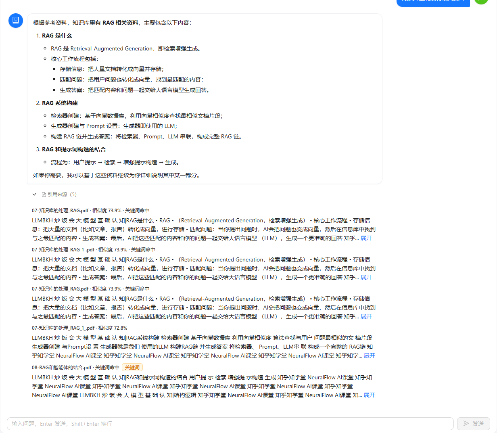
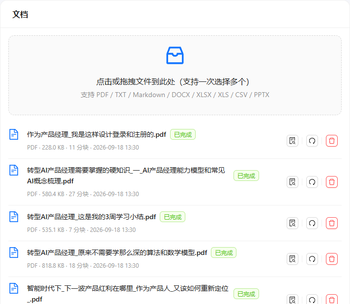
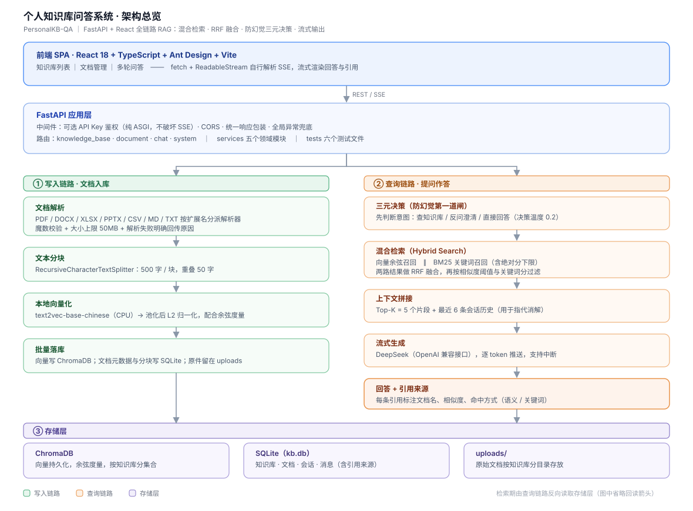

# PersonalKB-QA — 个人知识库问答系统

本地私有化部署的 RAG 知识库问答系统：上传文档（PDF/TXT/Markdown/DOCX/XLSX/XLS/CSV/PPTX）→ 解析分块 → 向量化 → 自然语言问答（流式输出 + 引用来源）。

完整技术设计见 [`DESIGN.md`](./DESIGN.md)（v1.1 评审修订版）。

> **在线体验**：[personal-kb-qa.app.workbuddy.host](https://personal-kb-qa.app.workbuddy.host/)
> 公网演示环境，内置「LLM 学习手册」知识库（21 篇 / 699 个分块，内容是 LLM 教科书与项目文档），
> 开箱即可提问，体验混合检索 + 引用溯源全流程。
> 演示环境有额度限制（单访客每日 3 次提问、全站每日 100 次），且不接受上传与删除。
> 部署方式见 [公网部署](#公网部署单端口形态)。

## 界面预览

**问答：流式输出 + 引用来源可展开** —— 每条引用标注所属文档、相似度与命中方式（语义 / 关键词）



**文档管理：批量上传、解析状态与分块数一目了然**



## 架构



写入链路负责把文档变成可检索的向量与元数据；查询链路先做**意图决策**，再走**混合检索**——两路召回用 RRF 融合、按阈值过滤后，把片段与引用一起交给模型流式作答。

| 关键环节 | 实现方式 |
| --- | --- |
| 混合检索 | 向量余弦召回 ∥ BM25 关键词召回 → **RRF 融合**（k=60）→ 相似度阈值 + 关键词分下限双重过滤 |
| 防幻觉 | 提问先做**三元决策**：查知识库 / 反问澄清 / 直接回答。检索不到就如实说，不硬答 |
| 多轮对话 | 决策与生成阶段均注入最近 6 条会话历史，解决「它 / 这个」类指代消解 |
| 流式输出 | SSE 逐 token 推送；鉴权用**纯 ASGI 中间件**实现，避免缓冲破坏流式响应 |
| 分块与向量 | 500 字 / 块、重叠 50 字；向量 L2 归一化后配合余弦度量，分数更可比 |

## 技术栈

- **前端**：React 18 + TypeScript + Ant Design 5 + Vite
- **后端**：Python FastAPI（端点统一同步 `def` + 线程池）
- **向量库**：ChromaDB（`PersistentClient` 嵌入式，cosine 度量）
- **Embedding**：`text2vec-base-chinese`（本地 sentence-transformers）、`BAAI/bge-small-zh-v1.5`（fastembed / ONNX，部署默认）或 OpenAI 兼容 API
- **LLM**：Ollama 或 OpenAI 兼容 API
- **存储**：SQLite（标准库 `sqlite3`，无 ORM）

## 目录结构

```
personal-kb-qa/
├── README.md
├── LICENSE
├── DESIGN.md          # 技术设计方案
├── docs/images/       # README 配图（架构总览 / 界面截图）
├── backend/           # FastAPI 后端
│   ├── config.demo.yaml  # 公网演示配置（fastembed / 数据目录隔离 / 额度护栏 / prefer_search）
│   ├── routers/       # knowledge_base · document · chat · system
│   ├── services/      # 文档解析 / 向量化 / 检索 / 对话 / LLM / 演示额度
│   ├── models/        # 请求响应模型
│   ├── middlewares/   # 可选 API Key 鉴权 + 演示写操作闸门（纯 ASGI）
│   └── tests/         # 单元测试（RRF 融合、决策分发、检索过滤、鉴权、API）
└── frontend/          # React 前端（src/pages · components · api）
```

## 快速开始

### 1. 后端

```bash
cd backend

# 创建虚拟环境（推荐）
python -m venv .venv
# Windows:
.venv\Scripts\activate
# Linux/macOS:
source .venv/bin/activate

# 安装依赖
pip install -r requirements.txt

# 启动服务（推荐：自动读取 config.yaml 的 host/port，启动前检测端口占用）
python run.py            # 开发时加 --reload
# 或者直接用 uvicorn：
uvicorn main:app --host 127.0.0.1 --port 8000 --reload
```

启动后访问：
- 健康检查：http://127.0.0.1:8000/health
- 接口文档（Swagger）：http://127.0.0.1:8000/docs

> **端口**：默认 8000，可用环境变量覆盖而无需改配置文件：
> ```bash
> # CMD:      set BACKEND_PORT=8001
> # Git Bash: BACKEND_PORT=8001 python run.py
> ```
> 若启动时提示端口被其他程序监听（如 Docker 容器端口映射），按提示换端口即可。

> **运行测试**：后端核心逻辑（RRF 融合、决策分发、检索过滤、鉴权、API 封装）有单元测试：
> ```bash
> pip install pytest
> pytest
> ```

> **依赖说明**：`requirements.txt` 中 RAG 重依赖（`torch` ~2GB、`chromadb`、`langchain`、`sentence-transformers`）体积较大。
> 若只想先跑通骨架与知识库 CRUD，可只装轻量依赖：
> ```bash
> pip install fastapi "uvicorn[standard]" pydantic pyyaml sse-starlette python-multipart
> ```
> 重依赖均采用**惰性导入**，未安装时 `/health` 会明确提示 `chroma/embedding` 不可用，文档处理与问答接口会返回清晰错误。

### 2. 前端

```bash
cd frontend
npm install
npm run dev
```

访问 http://localhost:5173 （Vite 已配置 `/api` 代理到后端 8000 端口）。

### 3. 配置 LLM / Embedding

编辑 `backend/config.yaml`：

- **Embedding 模式**：`embedding.mode` 设为 `local`（默认，首次运行会下载 `text2vec-base-chinese` 模型）或 `openai`（需 `OPENAI_API_KEY` 环境变量）。
- **LLM 模式**：`llm.mode` 设为 `openai`（默认，已配 DeepSeek）或 `ollama`（本地）。

当前默认配置为 **DeepSeek**，启动前设置环境变量：

```bash
# PowerShell
$env:OPENAI_API_KEY = "你的 DeepSeek key"
# 或 Git Bash
export OPENAI_API_KEY="你的 DeepSeek key"
```

改用其他 OpenAI 兼容服务（Kimi/智谱/通义等），只需改 `config.yaml` 里的 `llm.openai.base_url` 和 `model`。

本地 Ollama 方案（可选）：

```bash
ollama pull qwen2.5:7b
ollama serve
# 然后把 config.yaml 的 llm.mode 改回 ollama
```

## 中国大陆加速（推荐）

默认 pip 源与 HuggingFace 源在国内访问较慢、甚至超时/证书校验失败，建议：

```bash
# 1) pip 走清华镜像（重依赖安装提速明显）
pip install -r requirements.txt -i https://pypi.tuna.tsinghua.edu.cn/simple

# 2) HuggingFace 模型下载走镜像（首次 embedding 会下载 text2vec-base-chinese ~400MB）
#    Windows PowerShell:
$env:HF_ENDPOINT = "https://hf-mirror.com"
#    或 Git Bash / Linux / macOS:
export HF_ENDPOINT=https://hf-mirror.com
```

> `HF_ENDPOINT` 必须在**启动后端之前**设置；否则首次加载 embedding 模型时
> 直连 HuggingFace 会因 SSL 证书校验失败而重试超时，文档会卡在 `processing`。

## 公网部署（单端口形态）

线上 Demo 就是一个容器 + 一个 HTTP 端口 + SQLite，没有外部数据库、缓存或消息队列。

```bash
# 1) 装轻量依赖：部署清单去掉 sentence-transformers（会拖进 torch 约 2GB）与仅上传用得到的 langchain
pip install -r requirements.txt

# 2) 国内环境务必先关掉 Xet 传输协议，否则从 HuggingFace 镜像下模型会 401
export HF_HUB_DISABLE_XET=1

# 3) 用演示配置启动（数据目录隔离 + 打开额度护栏 + 偏检索决策）
PKB_CONFIG=config.demo.yaml BACKEND_PORT=8000 python backend/run.py
```

平台注入 `PORT` 时，`run.py` 会自动改为监听 `0.0.0.0:$PORT`（PaaS 约定）；本地不设该变量则行为不变。
启动前会做一次**依赖与应用导入自检**，缺包时把结论打在日志最后一行——云平台通常只回传日志尾部，
没有这段自检就只能靠猜。

| 部署相关开关 | 作用 |
| --- | --- |
| `embedding.mode: fastembed` | 切换 ONNX 轻量后端（`BAAI/bge-small-zh-v1.5`，512 维），免装 torch |
| `retrieval.prefer_search` | 为 true 时只要问题可能命中库内内容就强制检索；否则模型会把「教科书里的概念」当常识直接作答、不给引用 |
| `demo.enabled` | 打开额度与写操作护栏 |
| `server.frontend_dist` | 前端产物目录，默认 `../frontend/dist`；部署包可指向同级 `./webroot` |

### 演示环境的三道护栏

`services/demo_service.py` + `middlewares/demo_guard.py`（纯 ASGI，兼容 SSE 流式响应）：

1. **按访客 IP 的每日提问上限**（默认 3 次）
2. **全站每日提问硬上限**（默认 100 次）——即使 IP 被伪造也封顶成本
3. **写操作白名单**——只放行问答接口，上传 / 删除 / 新建一律 403

额度账本落在独立 SQLite（`demo.quota_db`），与业务库解耦，重建演示库也不会丢额度记录。
按 IP 识别访客依赖反向代理的 `X-Forwarded-For`，因此云模式下启用了 uvicorn 的 `proxy_headers`。

### 部署时容易踩的两个坑

- **前端产物目录不要叫 `dist/`**：部分上传/打包链路会把它当构建产物直接排除，结果是接口全好、页面空白。
  本项目用 `server.frontend_dist` 支持把产物放到 `./webroot`。
- **依赖不要精确钉死旧版本**：例如 `httpx==0.27` 会与现代版 `openai` 冲突，导致整条 `pip install` 解析失败、
  环境停在旧包上。部署清单一律用下限约束。

## 主要接口

| 方法 | 路径 | 说明 |
|------|------|------|
| POST/GET/DELETE | `/api/knowledge-bases` | 知识库增删查 |
| POST | `/api/knowledge-bases/{id}/documents` | 上传文档 |
| DELETE | `/api/documents/{doc_id}` | 删除文档 |
| POST | `/api/documents/{doc_id}/reprocess` | 重新处理 |
| POST | `/api/knowledge-bases/{id}/chat` | 问答（非流式） |
| POST | `/api/knowledge-bases/{id}/chat/stream` | 问答（SSE 流式） |
| GET | `/api/knowledge-bases/{id}/sessions` | 会话列表 |
| GET | `/api/sessions/{session_id}/messages` | 历史消息 |
| GET | `/health` | 健康检查 |

统一响应格式：`{ "code": 0, "data": ..., "message": "success" }`（`code != 0` 表示失败）。

## 测试

```bash
cd backend
pytest
```

> 测试目录 `backend/tests/` 已预留，可按需补充单元测试与检索验证。
